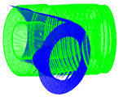
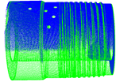
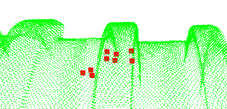

# Measurement System in 3D

This is my final project of master's degree, that is, *Automatic Industrial Measurement System Based on Registration*.

## Steps

The workflow of this system is shown as follows.

- [x] [Labeling/Marking a set of points representing the shape to be detected](./labeling_points) (10.2020)
- [x] [Coarse registration](./coarse_registration) (11.2020)
- [x] [Fine registration](./fine_registration) (11.2020)
- [x] [Searching the points to be measured in the specified point cloud](./search_points) (11.2020)
- [x] Combining all components (12.2020)

## Compiler

For now, all steps are tested and ran on `Windows 10` with `visual studio 2017`.

## Development Kits

Download from [here](https://1drv.ms/u/s!AnRiouA_fmTVml5dwH_br_p1cM7R?e=WszIbd).

## Requirements

Each step should have its dependencies libraries, also might require the whole libs as follows.

| Library | Purpose | Official Website | Usage| Note |
| :---:         |     :---:     | :---: | :---:|:---:|
 | Eigen 3.3.7   |  Core geometric calculation     | [link](http://eigen.tuxfamily.org/index.php?title=Main_Page)    | header-only | |
| OpenSceneGraph 3.6.4  |  Visulization of point cloud     | [link](http://www.openscenegraph.org/)    | compile require | |
| nanoflann 3.6.4  | Visiting operation in point cloud     | [link](https://github.com/jlblancoc/nanoflann)   | header-only | |
| CGAL 5.0.2  (The Computational Geometry Algorithms Library) | Associating with core geometric calculation     | [link](https://www.cgal.org/)   | compile require| |
| OpenGR(A C++ library for 3D Global Registration)  |  Implement Super4PCS for coarse registration  | [link](https://github.com/STORM-IRIT/OpenGR) or [link](https://storm-irit.github.io/OpenGR/index.html)   | header-only | |
| libpointmatcher with its `yaml-cpp-pm`   | Implement  ICP  for fine registration    | [link](https://github.com/ethz-asl/libpointmatcher)   | compile require | [modified version](https://github.com/Gltina/libpointmatcher) that support export matrix per iteration instead of completed vtk-file when setting `dumpReading`|

## Quick Demo

Here are four steps:

1. Marking/Labeling 

     
    
    The red zone consists of red points marked by operators. Meanwhile, these zone is marked as points, line, or plane. This process will not participate in the real-time inspection.

2. Registration
   
     

   From un-registration to registration.

3. Searching marked points

    

    
   Searching marked points in scanned point cloud with registration result.

4. Measurement

    The inspection including defect detection and geometric measurement, follows a specific relationship describing the marking items as below:

    |       	| Point 	| Line 	| Plane 	|
    |:-----:	|:-----:	|:----:	|:-----:	|
    | Point 	|  1\|2 	| 1\|2 	|  1\|2 	|
    |  Line 	|       	| 2\|3 	|  2\|3 	|
    | Plane 	|       	|      	|  2\|3 	|

    '1' indicates the geometric relationship, '2' means the scatter relationship, and '3' means the angle should be calculated between two items based on the normal vector.

    Through Plane-to-Plane and Point-to-Plane, the measurement reuslt(mm) is shown as below:

    |                	| Geometric 	| Scatter 	| Angle 	|
    |:--------------:	|:---------:	|:-------:	|:-----:	|
    | Plane-to-Plane 	|     -     	|  26.987 	| 8.656 	|
    | Point-to-Plane 	|   1.517   	|   1.70  	|   -   	|

    We do not need all values in table above.